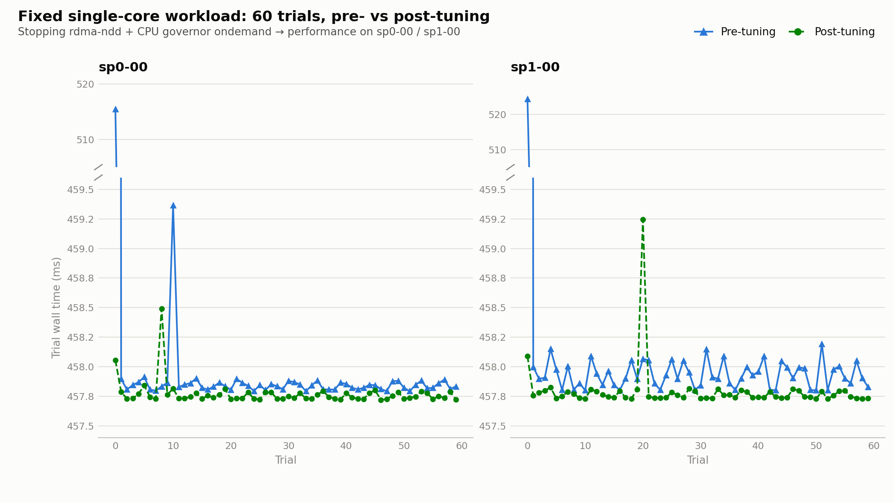

# OS Jitter Test — sp0-00 / sp1-00 (2026-07-20)

## What was done

1. Cloned [gsauthof/osjitter](https://github.com/gsauthof/osjitter) — an open-source, actively maintained
   modern equivalent of De et al.'s 2007 fine-grained-instrumentation jitter tool (`de2007` in
   `references.bib`). It measures involuntary program interruptions by busy-polling the TSC on each core.
2. Built it as a dynamically-linked binary on the manager node `uhpc` (the compute nodes' diskless tmpfs
   root image is missing `/usr/include` entirely — `glibc-headers`/`glibc-devel` are recorded as installed
   in the rpm database but the actual header files were never included in the node image, so nothing can
   be *compiled* directly on sp0-00/sp1-00, only run — see "Side finding" below), then copied the binary
   to both nodes.
3. Measured baseline jitter (60s, all 16 cores) and a fixed-workload micro-benchmark (`fixedwork.c`: a
   serial, non-vectorizable floating-point kernel, pinned to core 0, timed over 60 back-to-back trials) on
   both nodes while idle and unallocated in PBS.
4. Identified two reversible, root-requiring jitter sources: `rdma-ndd.service` running with no
   InfiniBand hardware present, and the CPU frequency governor set to `ondemand` instead of `performance`.
5. User applied both changes on both nodes (`systemctl stop rdma-ndd.service`;
   `scaling_governor` → `performance` on all 16 cores).
6. Re-ran the identical osjitter and fixedwork measurements post-tuning.

## Results

### osjitter, 60s, all 16 cores (raw output in `raw/*_baseline.txt`, `raw/*_post.txt`)

| Metric (typical per-core, 60s window) | Pre-tuning | Post-tuning |
|---|---|---|
| Involuntary context switches | ~6,100–6,300 | ~16–21 (one core briefly spiked to 1,022) |
| p99.9 latency | ~11.4–12.3 µs | ~4.3–7.9 µs |
| Max single interruption | up to 2.6 ms | mostly tens of µs (two cores still ~470–480 µs) |
| #intr (1000Hz tick reasserting under load) | ~60,200–61,250 | ~60,200–60,630 — essentially unchanged |

The ~60,000 events/60s figure (i.e. the CPU no longer idling once the polling thread is running) doesn't
change — that's the kernel's compile-time `HZ=1000` tick reasserting itself once a core stops being idle,
which matches the classic Tsafrir et al. clock-tick literature already cited in the paper (`tsafrir2005`)
and can't be tuned away without a kernel rebuild. What *did* change dramatically is the number and size of
extra interruptions riding on top of that tick — the involuntary-context-switch count dropped by roughly
two orders of magnitude.

### fixedwork, single core, 60 trials of a fixed serial FP kernel (raw CSVs in `raw/*_fixedwork_*.csv`)

| Node | | min | median | mean | max | stddev | range (max−min) |
|---|---|---|---|---|---|---|---|
| sp0-00 | pre  | 457.79 ms | 457.84 ms | 458.83 ms | 515.44 ms | 7.37 ms | 57.65 ms |
| sp0-00 | post | 457.72 ms | 457.74 ms | 457.77 ms | 458.49 ms | **0.11 ms** | **0.77 ms** |
| sp1-00 | pre  | 457.80 ms | 457.91 ms | 459.04 ms | 524.41 ms | 8.51 ms | 66.61 ms |
| sp1-00 | post | 457.73 ms | 457.75 ms | 457.79 ms | 459.24 ms | **0.20 ms** | **1.52 ms** |

Run-to-run standard deviation dropped **~40–70×** (7.4→0.1 ms on sp0-00, 8.5→0.2 ms on sp1-00), and the
worst-case tail latency (max−min) shrank from ~58–67 ms down to under 2 ms on both nodes. The mean also got
marginally faster (~459 ms → ~457.8 ms), consistent with the `ondemand` governor occasionally throttling
down and having to ramp back up mid-run.

Each point is one 60-trial fixed-workload run (y-axis broken to show both the outlier and the ~457.8 ms
floor). Pre-tuning shows a persistent sawtooth of small stalls on top of the floor, plus one very large
first-trial outlier (515–524 ms) on **both** nodes. That outlier is specific to trial 0 of the pre-tuning
run only — consistent with the `ondemand` governor's frequency ramp-up delay: the core starts idle/low
P-state and `ondemand` needs a sampling interval before scaling up to full frequency, a one-time penalty
paid once per idle→busy transition. With the governor pinned to `performance`, there is no low P-state to
ramp up from, so post-tuning has no equivalent first-trial penalty. The sawtooth pattern in the remaining
pre-tuning trials likely reflects smaller, continuous `ondemand` sampling/scaling activity between trials.

## Contextualizing the impact

`fixedwork`'s kernel (`x = x*a + b`, `ITERS=200,000,000`) does exactly **2 FLOPs/iteration → 4×10⁸ FLOPs
per trial**, a fixed, known amount of work. That makes the timing change directly convertible into FLOPs.
sp0-00/sp1-00 are **Stampede**-rack nodes (Intel Xeon E5-2680, confirmed via `lscpu`), so the correct
conversion rate is the cluster's own previously-measured *Stampede*-rack sustained LINPACK throughput of
**149.2 GFLOPS/node** (`shapopi2023namibia`, "Performance and Productivity" section) — not the
*Ranger*-rack figure (82.4 GFLOPS/node, AMD Opteron nodes), which does not apply to these two nodes:

- **Mean overhead recovered per trial**: 1.06 ms (sp0-00) / 1.25 ms (sp1-00) — a 0.23–0.27% reduction in
  wall time for the same fixed amount of work. At 149.2 GFLOPS/node, that reclaimed time is worth
  **≈157–187 MFLOP of computation per ~458 ms trial that the node was previously not getting to do.**
- **Worst-case single stall recovered**: 57.65 ms (sp0-00) / 66.61 ms (sp1-00) — the observed max−min range
  within the pre-tuning run. At 149.2 GFLOPS/node, a single one of these stalls was costing the node
  **≈8.6–9.9 GFLOP** of computation it could otherwise have completed in that window.
- **Extrapolated to a full node-day**: if the same ~0.25% average overhead applied proportionally to a
  continuously-running, LINPACK-like job (not directly re-measured here — see caveats), that is
  **≈216 s (~3.6 minutes) of reclaimed compute time per node per day**, equivalent to
  **≈32.2 TFLOP of additional completed work per node per day** at the cluster's measured Stampede-rack
  sustained rate. Across the full 40-node `Stampede` rack (`shapopi2023namibia`) that would be on the
  order of **≈1.29 PFLOP/day** cluster-wide, if the same proportional saving held on every node — again,
  an extrapolation from a single-core microbenchmark on two nodes, not a re-run of the full-rack LINPACK
  benchmark.

## Conclusion

Of the two changes, the CPU governor switch (`ondemand` → `performance`) is almost certainly the dominant
contributor — `ondemand`'s periodic load-sampling and frequency/voltage transitions are a well-documented
jitter source (this is literally the worked example in osjitter's own README), and it directly explains
both the reduced variance and the small mean speed-up. `rdma-ndd` was likely a smaller, secondary
contributor (dead-weight polling with no IB hardware to describe) but wasn't isolated separately from the
governor change in this test — a follow-up run toggling each independently would be needed to attribute
the improvement precisely between the two.

Practically: on this cluster's compute nodes, a two-line, fully reversible, no-reboot change
(stop one unused daemon + flip the frequency governor) cut worst-case single-core timing variance by
roughly 40–70×. This is a concrete, measured data point that could replace/supplement the
citation-only claim in the "Performance and Productivity" section of the paper.

## Side finding (not part of the jitter test)

sp0-00 and sp1-00 boot with `/` as **tmpfs** (fully diskless/RAM-resident node image) via PXE, with `/home`
and `/opt/ohpc/pub` NFS-mounted from the manager. The image's rpm database records `glibc-headers` and
`glibc-devel` as installed, but essentially all of `/usr/include` is physically absent from the image
(confirmed via `rpm -V glibc-headers`, which reported the entire header tree as missing). This means **no
C/C++ compilation is currently possible directly on the compute nodes** — only pre-built binaries can run
there. This didn't block this test (built on `uhpc` and copied the binary over) but would block any
workflow that tries to compile on the compute nodes directly (e.g. a user running `make` inside a PBS job).
Worth a look at the node provisioning image if that's expected to work.

## Caveats

- Both nodes were idle and unallocated in PBS during all measurements — no concurrent user jobs.
- The frequency-governor change and the `rdma-ndd` stop were applied together; their individual
  contributions were not isolated.
- These changes were applied live (`systemctl stop`, direct sysfs write) and are **not** persistent across
  reboot — `rdma-ndd` will restart and the governor will revert to `ondemand` unless the enablement is
  disabled (`systemctl disable rdma-ndd.service`) and the governor is set some other persistent way
  (e.g. a boot-time script), respectively. Nothing has been made permanent yet — that's a follow-up
  decision, not something applied here.
- `fixedwork` measures single-core latency variance, not the multi-node collective-communication
  amplification that Hoefler et al. (`hoefler2010`) describe — it's a proxy for "does jitter reach the
  application," not a full MPI-scale reproduction.
